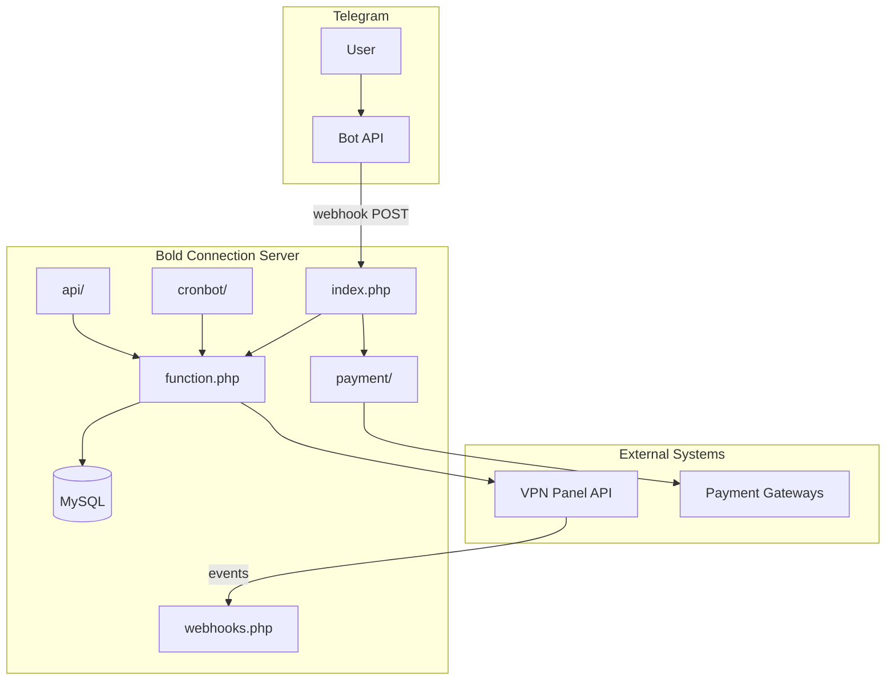

# Bold Connection

**Bold Connection** is a production-grade Telegram bot platform for selling and managing VPN subscriptions. It connects Telegram users to industrial VPN panels (Marzban, 3x-ui, Alireza, Hiddify, and others), automates configuration provisioning, and supports multiple payment gateways with wallet, referral, and admin tooling.

> This repository is the **Bold Connection** distribution of the Mirza Bot codebase (version **0.1.5**), with security hardening, professional documentation, and a one-click Linux installer.

---

## Table of Contents

- [Overview](#overview)
- [Architecture at a Glance](#architecture-at-a-glance)
- [Features](#features)
- [Repository Layout](#repository-layout)
- [Quick Start](#quick-start)
- [Documentation](#documentation)
- [Security](#security)
- [Support & License](#support--license)

---

## Overview

Bold Connection acts as the **commercial layer** between Telegram customers and your VPN infrastructure:

| Layer | Role |
|-------|------|
| **Telegram** | User interface — purchases, support, account management |
| **Bold Connection (this project)** | Business logic, payments, database, cron jobs, admin API |
| **VPN panels** | Actual proxy/VPN user provisioning (Marzban, 3x-ui, …) |
| **Payment gateways** | Zarinpal, card-to-card, crypto, and other providers |

Typical flow:

1. User sends `/start` in Telegram.
2. Telegram POSTs the update to `index.php` (webhook).
3. User selects a product and pays via a configured gateway.
4. On payment confirmation, the bot calls the panel API and delivers the subscription link.
5. Panel events (expiry, usage) can POST back to `webhooks.php`.

---

## Architecture at a Glance



**Entry points**

| File | Purpose |
|------|---------|
| [`index.php`](index.php) | Main Telegram webhook handler |
| [`webhooks.php`](webhooks.php) | Panel notification webhook |
| [`payment/*.php`](payment/) | Payment gateway callbacks |
| [`api/*.php`](api/) | REST-style admin/integration API |
| [`cronbot/*.php`](cronbot/) | Scheduled background tasks |
| [`table.php`](table.php) | Database schema bootstrap & migrations |

**Core libraries**

| File | Purpose |
|------|---------|
| [`config.php`](config.php) | Environment configuration (not in git — copy from [`config.example.php`](config.example.php)) |
| [`function.php`](function.php) | Shared helpers, payment atomics, cron registration |
| [`panels.php`](panels.php) | Multi-panel abstraction (`ManagePanel` class) |
| [`botapi.php`](botapi.php) | Telegram Bot API wrapper |

---

## Features

### Customer-facing

- VPN purchase with automatic config creation
- Trial accounts, renewals, volume top-ups
- Wallet balance, referrals, discounts
- Mandatory channel membership
- Multi-language text customization
- Mini App storefront (`api/miniapp.php`)

### Admin & operations

- Multi-admin support
- Product, category, and panel management
- Payment gateway configuration
- Broadcast messaging and reports
- REST API under `/api/` with token auth
- Automated cron jobs (expiry, notifications, backups)

### Supported integrations

- **Panels:** Marzban, Marzneshin, 3x-ui, Alireza, Hiddify, S-UI, and more via [`panels.php`](panels.php)
- **Payments:** Zarinpal, Aqayepardakht, IranPay, Tronado, NowPayments, Plisio, card-to-card, Telegram Stars

---

## Repository Layout

```
bold-connection/
├── index.php              # Telegram webhook
├── webhooks.php           # Panel webhook
├── config.example.php     # Configuration template
├── function.php           # Core helpers
├── panels.php             # Panel drivers
├── table.php              # DB migrations
├── install.sh             # One-click Linux installer
├── api/                   # HTTP API modules
├── payment/               # Gateway callbacks
├── cronbot/               # Cron endpoints
├── docs/                  # Full documentation
└── vendor/                # PHP dependencies (committed)
```

---

## Quick Start

### Prerequisites

- Ubuntu 20.04+ / 22.04 / 24.04 or Debian 11/12
- Root access
- A domain pointing to the server (A record)
- A Telegram bot token from [@BotFather](https://t.me/BotFather)
- GitHub Personal Access Token with `repo` scope (private repository)

### One-command install

Because this repository is **private**, authenticate before downloading the installer:

```bash
export GITHUB_PAT="ghp_your_token_here"
curl -fsSL \
  -H "Authorization: token ${GITHUB_PAT}" \
  -H "Accept: application/vnd.github.raw" \
  "https://raw.githubusercontent.com/Recoba86/Bold-Connection/main/install.sh" \
  -o /tmp/bold-install.sh

sudo bash /tmp/bold-install.sh
```

The installer is **fully interactive** — it prompts for domain, bot token, admin chat ID, database credentials, and security secrets, then produces a production-ready deployment.

See [docs/installer.md](docs/installer.md) for menu options (install / update / repair / remove).

### Manual install (summary)

1. Copy [`config.example.php`](config.example.php) → `config.php` and fill values.
2. Create MySQL database and import schema via `https://your-domain/table.php`.
3. Register Telegram webhook:

   ```bash
   curl -s "https://api.telegram.org/bot<TOKEN>/setWebhook" \
     -d "url=https://your-domain/index.php" \
     -d "secret_token=<telegram_webhook_secret>"
   ```

4. Configure cron jobs (see [docs/deployment.md](docs/deployment.md)).

---

## Documentation

| Document | Description |
|----------|-------------|
| [docs/architecture.md](docs/architecture.md) | System design, data flows, component map |
| [docs/deployment.md](docs/deployment.md) | Production deployment guide |
| [docs/configuration.md](docs/configuration.md) | All configuration variables |
| [docs/environment.md](docs/environment.md) | Server requirements & PHP extensions |
| [docs/api.md](docs/api.md) | REST API reference |
| [docs/modules.md](docs/modules.md) | Payment, panel, cron, and mini-app modules |
| [docs/security.md](docs/security.md) | Security model and hardening checklist |
| [docs/installer.md](docs/installer.md) | Installer reference & troubleshooting |
| [docs/cleanup-mirza-and-install.md](docs/cleanup-mirza-and-install.md) | Remove old Mirza Pro install, install Bold Connection only |
| [docs/راهنمای-نصب-تلگرام-و-پنل.md](docs/راهنمای-نصب-تلگرام-و-پنل.md) | Persian Telegram + panel setup guide |

---

## Security

Bold Connection 0.1.5 includes:

- PDO-only database access with prepared statements
- Atomic payment confirmation (`confirmPaymentAtomically`)
- Optional Telegram webhook secret token validation
- Decoupled payment/panel webhook secret (`$payment_webhook_key`)
- TLS verification for outbound HTTP (configurable for dev only)
- IDOR guards on invoice/service ownership checks

**Before production:** set `$telegram_webhook_secret` and `$payment_webhook_key` in `config.php`. See [docs/security.md](docs/security.md).

---

## Support & License

- **Version:** 0.1.5 (see [`version`](version))
- **Distribution:** Bold Connection (private repository under Recoba86)
- **Upstream lineage:** Mirza Bot / Mirza Panel ecosystem

For deployment help, start with [docs/deployment.md](docs/deployment.md) and [docs/installer.md](docs/installer.md).
