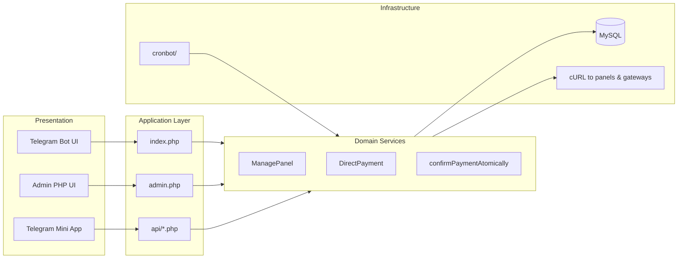
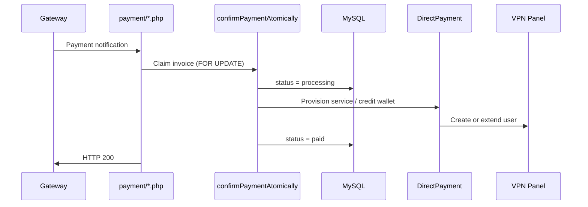

# System Architecture

This document describes how Bold Connection is structured, how requests flow through the system, and how major components interact.

---

## High-Level Layers

---

## Request Types

### 1. Telegram webhook (`index.php`)

Telegram sends JSON updates via POST when webhook mode is enabled.

**Processing pipeline:**

1. Load [`config.php`](../config.php), [`botapi.php`](../botapi.php), [`function.php`](../function.php)
2. Validate source IP (`checktelegramip()`)
3. Validate `X-Telegram-Bot-Api-Secret-Token` if `$telegram_webhook_secret` is set
4. Parse update: message, callback query, chat member events
5. Route to handler blocks (thousands of lines in `index.php` — command/callback driven)
6. Call panel APIs via `ManagePanel` for provisioning
7. Always return HTTP 200 on unrecoverable errors (prevents Telegram retry storms)

### 2. Panel webhook (`webhooks.php`)

Used when VPN panels push events (user expiry, usage thresholds, etc.).

**Security:**

- Header `X-Webhook-Secret` must match `$payment_webhook_key` (raw or base64-encoded)
- Legacy fallback: admin password from database (not recommended)

**Reliability:**

- Wrapped in try/catch + shutdown handler
- Always returns HTTP 200 to prevent panel retry loops

### 3. Payment callbacks (`payment/*.php`)

Each gateway has its own callback URL, e.g.:

- `payment/zarinpal.php`
- `payment/card.php`
- `payment/tronado.php`

**Payment confirmation flow:**

`confirmPaymentAtomically()` in [`function.php`](../function.php) prevents double-crediting under concurrent callbacks.

### 4. REST API (`api/*.php`)

Token-authenticated JSON API for external admin tools and the Mini App.

- Auth: `Token` HTTP header must equal bot `$APIKEY`
- Actions passed as JSON field `actions`
- All requests logged to `logs_api` table

See [api.md](api.md) for endpoint reference.

### 5. Cron endpoints (`cronbot/*.php`)

Invoked by system crontab via `curl https://domain/cronbot/<script>.php`.

Registered by `activecron()` in [`function.php`](../function.php) when admin panel loads, or manually by the installer.

---

## Database Model (conceptual)

Bold Connection uses MySQL with tables created/migrated by [`table.php`](../table.php). Key entity groups:

| Group | Examples |
|-------|----------|
| Users | `user`, wallet balance, referral codes |
| Commerce | `product`, `category`, invoices, discounts |
| Services | Active VPN subscriptions linked to panel usernames |
| Panels | Panel credentials, types, inbounds |
| Payments | `Payment_report`, gateway settings in `PaySetting` |
| Admin | `admin`, topics, reports, settings |
| API | `logs_api` |

Run `table.php` once after install and on upgrades — it applies incremental `ALTER TABLE` migrations idempotently.

---

## Panel Abstraction

[`panels.php`](../panels.php) defines `ManagePanel`, which routes operations by panel `type`:

| Type | Driver file |
|------|-------------|
| marzban | `Marzban.php` |
| marzneshin | `marzneshin.php` |
| alireza_single | `alireza_single.php` |
| hiddify | `hiddify.php` |
| s_ui | `s_ui.php` |
| … | Additional drivers in repo root |

Operations: create user, renew, add volume, disable, reset traffic, fetch subscription link.

---

## Configuration Bootstrap

[`config.example.php`](../config.example.php) → `config.php`:

- Creates PDO connection (`$pdo`)
- On connection failure during HTTP requests: returns JSON 200 and exits (webhook-safe)
- Exposes globals used across the codebase: `$APIKEY`, `$domainhosts`, security flags

---

## Error Handling Philosophy

| Context | Behavior |
|---------|----------|
| Telegram webhook | Log error, return 200 |
| Panel webhook | Log error, return 200 |
| Payment callback | Atomic transaction, log failures |
| CLI / cron | Errors logged to `error_log` file |
| API | JSON error response with appropriate HTTP code |

---

## Scaling Considerations

- **Single-server default:** Apache + PHP + MySQL on one VPS
- **High-load panels:** Tune `$request_exec_timeout` in config for slow panel APIs
- **Database:** All hot paths use PDO prepared statements; avoid re-introducing bulk preloads in `index.php`
- **Cron frequency:** Balance notification latency vs. server load (see `activecron()` schedule)

---

## Related Documents

- [deployment.md](deployment.md) — how to deploy this architecture
- [configuration.md](configuration.md) — config variables
- [modules.md](modules.md) — module-level detail
- [security.md](security.md) — threat model and controls
